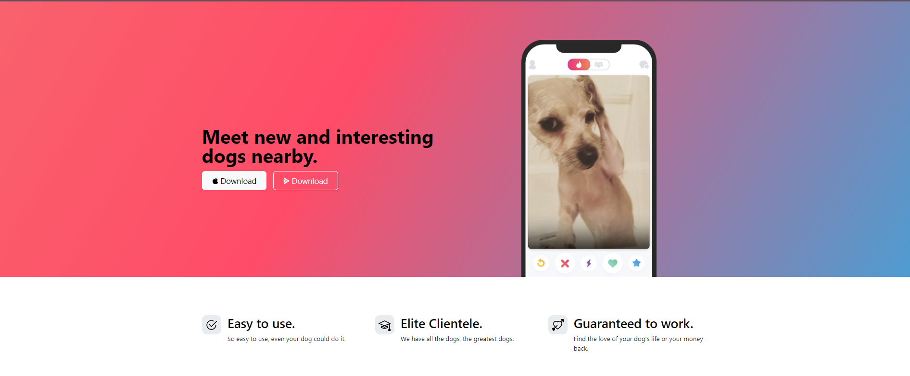

# 🐶 Tin Dog Website

Welcome to the Tin Dog website! This visually appealing and responsive web page is built using HTML and CSS. Tin Dog is a fictional app designed for dog lovers to find the perfect match for their pets. The website is structured to provide an engaging user experience with well-organized content and stylish design elements.

## ✨ Features
- 📱 **Responsive Design**: Ensures the website looks great on all devices, including desktops, tablets, and mobile phones.
- 🎨 **Stylish Layout**: Uses CSS to create an attractive and user-friendly interface.
- 📋 **Informative Sections**: Includes various sections such as features, testimonials, and a call-to-action, all designed to highlight the benefits of the Tin Dog app.

## 🛠️ Technologies Used
- **HTML**: Used for structuring the website content.
- **CSS**: Used for styling the website and ensuring a consistent look and feel across different devices.

## 🌐 How to Use
1. **Open the website** in a web browser to explore the Tin Dog app features.
2. **Navigate through different sections** to learn more about the app and its benefits.

## 📂 File Structure
- `index.html`: The main HTML file containing the structure of the website.
- `styles.css`: The CSS file for styling the website.

Explore the Tin Dog website to discover how it can help dog lovers find the perfect match for their pets! 🐾

